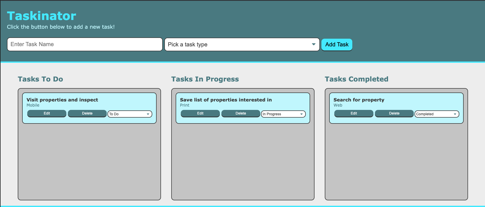

# Taskinator

## Description
An Interactive To Do List based on the Kanban Board approach.  User can add new tasks, choose a task type, and they will be saved to localStorage on their device.  Task will show up in To Do List and can be edited or moved, by using a dropdown selector, to In Progress or Completed.  User may also delete any task item, at any time.  Currently, task type is limited to Web, Print, or Mobile.

## Page Link

https://sherriw.github.io/Taskinator/

## Table of Contents

- [Taskinator](#taskinator)
  - [Description](#description)
  - [Page Link](#page-link)
  - [Table of Contents](#table-of-contents)
  - [Built With](#built-with)
  - [Code Link](#code-link)
  - [Visuals](#visuals)
  - [User Story](#user-story)
  - [CRITERIA](#criteria)
  - [Installation](#installation)
  - [Usage](#usage)
  - [Support](#support)
  - [Roadmap](#roadmap)
  - [Contributions & Acknowledgements](#contributions--acknowledgements)
  - [Credits](#credits)
  - [License](#license)

## Built With
- HTML
- CSS
- Web API
- Javascript
- localStorage

Code was created using Visual Studio Code and HomeBrew.

## Code Link

https://github.com/SherriW/Taskinator

## Visuals

Main Page
  

## User Story

AS A user

- I WANT a simple task list.
  - SO THAT I can track what I need to do, have in progress, and have recently completed.

## CRITERIA

- GIVEN THAT I need to keep track of tasks I need to print, view on web, or are mobile activities
  - WHEN I open the application
    - THEN I presented with a clean and simple interface to use.
  - WHEN I want to add a task
    - THEN I type a brief description in an input box
  - WHEN I want to choose the type of task
    - THEN I am presented with a dropdown list, where I can pick from 3 types: print, web,  and mobile.
  - WHEN I click add task
    - THEN the task is saved to my local machine
  - WHEN I wish to edit a task
    - THEN I can click on the edit button
    - THEN the task will open into the input fields for editing
    - THEN I can click the SAVE button
  - WHEN I wish to delete a task
    - THEN I can click the delete button
    - THEN the task will be removed perminently
  - WHEN I wish to change the category the task is in
    - THEN I click the dropdown list and select from To Do, In Progress, or Completed
    - THEN the task will be moved to the selected list.
  - WHEN I return to the task list, after closing the browser
    - THEN the saved tasks will be listed in their appropriate categories. (Only on the original device that task was entered on.)

## Installation

The application/site can be displayed in a web browser and was built mobile first to be responsive to a variety of devices and screen sizes.

## Usage
For personal, non-commercial, and educational use and participating developer(s) portfolio purposes.

## Support
Contact:  Sherri Winslow
Email:  swinslowcoding@gmail.com

## Roadmap

Initial:
Limited task list to be utilized on a single device

Future futures:

- Expand user ability to customize types
- Synchronized storage with icloud

## Contributions & Acknowledgements
You may send any feedback on the code to swinslowcoding@gmail.com

## Credits
Developer: Sherri Winslow.
Acknowledgements:  I would like to express my appreciation to my Tutor - Sandra Smith; Instructor - Dan Seskey; and TAs - Matt Torcellini, Symone Varnado, Nathan Sartain, and Jaime Montero who have been instrumental in keeping me on track and supporting me, while providing a quality education through UConn.

Developers:
- Name
- Name
## License
For Personal, Educational purposes and Portfolio use.

©2021 Sherri Winslow